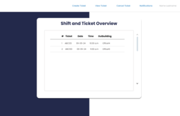
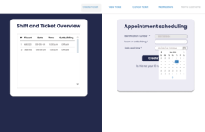

<h1 align="center">Ticket Manager React Micro Frontends</h1>
<p align="center">
Modular application using Micro Frontends (Webpack Module Federation) to manage shifts / tickets: creation, lookup, cancellation, and status viewing. The `host` container orchestrates navigation, a simple in-memory authentication, and consumption of remote microfrontends.
</p>

---

<h2 align="left">Index</h2>

- [Core Goals](#core-goals)
- [Architecture](#architecture)
- [Architecture Diagram](#architecture-diagram)
- [Ports / Remotes](#ports--remotes)
- [Functional Flow (Current)](#functional-flow-current)
- [Main Routes (Host)](#main-routes-host)
- [Key Technologies](#key-technologies)
- [Common Scripts (per microfrontend)](#common-scripts-per-microfrontend)
- [Local Installation \& Run](#local-installation--run)
- [Folder Structure](#folder-structure)
- [Environment Variables](#environment-variables)
- [Deployment Strategy](#deployment-strategy)
- [Snapshots](#snapshots)
- [Current Limitations / Risks](#current-limitations--risks)
- [Next Improvements](#next-improvements)
- [Authors](#authors)
- [License](#license)

## Core Goals

- Decouple functional domains (login, signup, navigation, ticket operations) for independent scalability.
- Enable isolated deployments per vertical slice.
- Share a single React runtime (singleton) to avoid bundle duplication.

## Architecture

**Host (`host`)**: Main router, `AuthContext`, lazy loaded pages, remote consumption.

**Microfrontends**:

- `mf-login`: Exposes `LogIn` component.
- `mf-signup`: Exposes `SignUp` component.
- `mf-navbar`: Navigation bar.
- `mf-ticket-create`: Exposes `TicketCreate` (appointment scheduling - local state only).
- `mf-ticket-cancel`: Exposes `TicketCancel` (cancellation simulation).
- `mf-ticket-view`: Exposes `TicketView` (status search simulation).
- `mf-ticket-table`: Exposes `TicketTable` (generic table renderer for dynamic data).

**Communication**: Each MFE exposes a `remoteEntry.js` and the host references them through `remotes` in its `ModuleFederationPlugin` configuration.

**State Layer**: No backend persistence included yet; forms store data in local component state for demonstration.

**Styling**: Bootstrap 5 + local CSS modules/files.

**Auth**: Simple role-based redirection (`admin` vs standard user) managed in `AuthContext`. No token management yet.

## Architecture Diagram

[](https://raw.githubusercontent.com/danieltorrez29/TicketManagerFrontend/refs/heads/master/resources/img/diagrams/ticket-manager-react-mf-arquitecture.png)

## Ports / Remotes

| Microfrontend     | Port |
| ----------------- | ---- |
| host              | 8080 |
| mf-login          | 8081 |
| mf-signup         | 8082 |
| mf-navbar         | 8083 |
| mf-ticket-table   | 8084 |
| mf-ticket-create  | 8085 |
| mf-ticket-cancel  | 8086 |
| mf-ticket-view    | 8089 |

## Functional Flow (Current)

1. User opens `/` → login screen (host page).
2. Signup available at `/signup`.
3. Upon login, `user` is stored in `AuthContext`; redirect logic:
   - `admin` → `/admin/dashboard`
   - others → `/user/dashboard`
4. From dashboards navigation leads to:
   - Create ticket: `/user/dashboard/create` or `/admin/dashboard/create`
   - Cancel ticket: `/.../cancel`
   - View ticket status: `/.../view`
   - Notifications: `/user/dashboard/notifications` (placeholder page)
5. Ticket-related modules presently rely on in-memory state (no persistence).

## Main Routes (Host)

- `/` Login
- `/signup` Registration
- `/admin/dashboard`
- `/user/dashboard`
- `/user|admin/dashboard/create`
- `/user|admin/dashboard/cancel`
- `/user/dashboard/view`
- `/user/dashboard/notifications`

Planned enhancement: enforce guards by wrapping protected routes with `PrivateRoute` consistently.

## Key Technologies

- React 18
- React Router DOM v6
- Webpack 5 Module Federation
- Babel (transpilation)
- Bootstrap 5 / React Bootstrap
- Dotenv (environment variable injection at build time)

## Common Scripts (per microfrontend)

```bash
npm start         # Dev server with HMR
npm run build     # Production build (outputs to dist/)
npm run build:start  # Serve build (requires npx serve; ensure it's installed)
```

## Local Installation & Run

From each folder (`host` and every `mf-*`):

```bash
npm install
npm start
```

Recommended startup order (ensures remotes ready before host):

1. mf-login
2. mf-signup
3. mf-navbar
4. mf-ticket-table
5. mf-ticket-create
6. mf-ticket-cancel
7. mf-ticket-view
8. host (last)

Then open: <http://localhost:8080>

(Future optimization: a root-level script using `concurrently` to launch all.)

## Folder Structure

- `host/src/pages/*` Lazy loaded page components.
- `host/src/context/AuthContext.js` Simple auth state provider.
- `host/src/PrivateRoute.js` Guard component (not fully applied yet).
- `mf-*/src/components/*` Exposed or internal functional components.

## Environment Variables

Each `webpack.config.js` loads `.env` through `dotenv-webpack`.

Example per microfrontend:

```env
API_BASE_URL=http://localhost:3000/api
```

Adjust `publicPath` and remote URLs for production builds.

## Deployment Strategy

1. Build each microfrontend: `npm run build` (generates `dist/`).
2. Host each `dist/` on a static hosting service (ensure `remoteEntry.js` is publicly reachable).
3. Update `remotes` in the host `webpack.config.js` to point to production URLs.
4. Build and deploy host after remotes are live.

## Snapshots

Here are some representative snapshots of the application:

[](https://raw.githubusercontent.com/danieltorrez29/TicketManagerFrontend/refs/heads/master/resources/img/snapshots/login.png)
[](https://raw.githubusercontent.com/danieltorrez29/TicketManagerFrontend/refs/heads/master/resources/img/snapshots/signup.png)
[](https://raw.githubusercontent.com/danieltorrez29/TicketManagerFrontend/refs/heads/master/resources/img/snapshots/view-tickets.png)
[](https://raw.githubusercontent.com/danieltorrez29/TicketManagerFrontend/refs/heads/master/resources/img/snapshots/create-ticket.png)
[](https://raw.githubusercontent.com/danieltorrez29/TicketManagerFrontend/refs/heads/master/resources/img/snapshots/delete-ticket.png)
[](https://raw.githubusercontent.com/danieltorrez29/TicketManagerFrontend/refs/heads/master/resources/img/snapshots/notifications.png)

## Current Limitations / Risks

- No real persistence (mock/in-memory only).
- Role validation limited to initial redirect (no deep route enforcement yet).
- No session/token lifecycle handling.
- Hardcoded samples (e.g., identification number field locked in creation form).
- Lacking form-level + domain validation error system.

## Next Improvements

- Integrate real backend (REST or GraphQL) for tickets and users.
- Replace local component state with React Query / Zustand / Redux Toolkit as complexity grows.
- Apply `PrivateRoute` to all protected dashboard routes.
- Mount `mf-navbar` inside a shared `Layout` wrapper.
- Centralized error boundary + toast notification layer.
- Replace static form values with dynamic data sources.
- Add unit tests (Jest + React Testing Library) and E2E tests (Playwright or Cypress).
- Root orchestration script (`npm run dev:all`).
- Containerization (Docker) per microfrontend and compose file for orchestration.
- Performance auditing (bundle size, shared deps pruning).

## Authors

- [@danieltorrez29](https://github.com/danieltorrez29) – Systems and Computer Engineer - Database Specialist.
- [@TCfajardo](https://github.com/TCfajardo) – Systems and Computer Engineer.
- [@EstebanBarrero](https://github.com/EstebanBarrero) – Systems and Computer Engineer.

## License

This project is licensed under the MIT License - see the [LICENSE](LICENSE) file for details
